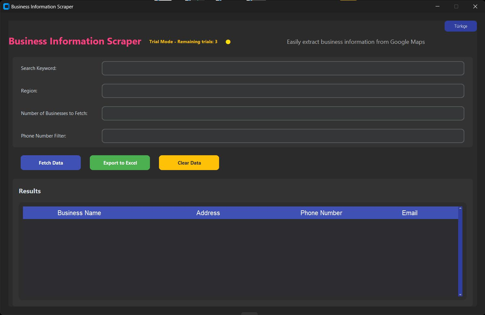

# Google Maps Data Collection Tool

Free Demo Download: 
https://github.com/halitartuc/Google-Maps-Scraping/releases/tag/v.1.0.0

## About the Product

This software is a user-friendly tool that allows you to easily collect business data from Google Maps. You can automatically extract business names, addresses, phone numbers, and more.

## How to Use

1. Download and install the application on your computer
2. Enter the keywords and location information you want to search
3. Start the data collection process
4. Results will be automatically saved to an Excel file

## Free Trial

We offer 5 free searches with the trial version. Try before you buy to make sure it meets your needs!

## Pricing

The full version is available for 250TRY (6.50 USD) with lifetime updates and support.

## How to Purchase

To purchase our product:

1. Visit [our website](https://www.shopier.com/s/product/34715616)
2. Click the "Buy Now" button
3. Enter your username and password (or create a new account)
4. Complete the payment process
5. You can download the software using the link sent to your email

For any questions or support, please contact us: halitartuc@gmail.com 
